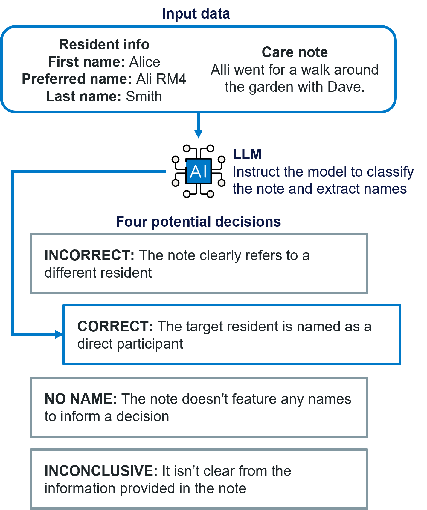
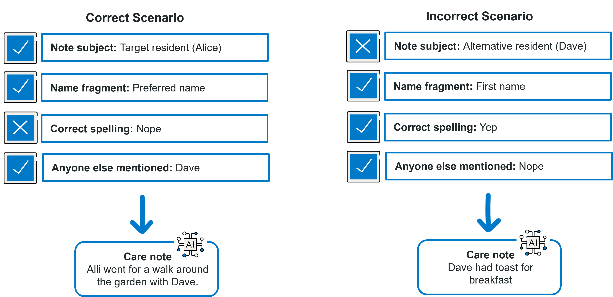

# In construction 🚧
This is a WIP :3

## Problem Statement
As our reliance on LLMs to generate and transform unstructured text data grows, we must consider how to confidently evaluate the performance of the model. This is particularly important for tasks like classification where the output can inform business-critical decision making. 

LLMs were originally chosen to perform the task because they require no training, only a prompt, and are thus much faster to set-up. They don't require a labelled training dataset to understand the task. This is ideal for quick development and deployment, but poses a significant risk when the evaluating the output. **Without a labelled dataset, how do we know if the model is correct?**

One solution is to manually observe outputs as they are generated. While a human-in-the-loop is recommended, it can't be the only solution. Manual labelling is prone to human error and doesn't result in a large enough dataset. 

What if there was a way to simulate production data, its structure and patterns, and automatically and confidently label it?

## ShadowTraffic: Dummy Data Generation
This repo explores how to use ShadowTraffic to efficiently generate simulated data using instructions in JSON format:
1. Create a config that designs controlled scenarios, highlighting the key patterns the text data needs to capture
2. Parse each scenario to an LLM for text generation
3. Label the text data using the config values

This dataset can then be used to test the accuracy of the production model.

ShadowTraffic allows us to randomise names, booleans (`"misspelt": true`), select from lists (`"noteResident": "target"`). These features combined create the config required to set-up scenarios.

## Care Note Example
We're using LLMs to identify whether a care note has been saved to the correct patient:



Therefore, our controlled, labelled dataset will need to include a variety of strings containing names - some being the target patient and others being random people. We can also control:
- What name fragment was used for the resident? Was an unrecorded nickname used?
- Does the note use the expected pronouns (align with the patient's recorded sex)?
- Is their name spelt correctly?
- Does anyone else feature in the note? In what capacity?



An example output from our ShadowTraffic config looks like this:

```json
{
    "targetResident" : {
        "firstName" : "Moshe",
        "preferredName" : "Arthur",
        "lastName" : "Weissnat",
        "sex" : "Male"
    },
    "alternativeResident" : {
        "firstName" : "Shoshana",
        "lastName" : "Tillman",
        "sex" : "Male",
        "preferredName" : "Tyrell"
    },
    "noteScenario" : {
        "noteResident" : "alternative",
        "additionalNamesMentioned" : "Reed",
        "sentiment" : "neutral"
    },
    "nameUsage" : {
        "pronounUsage" : "non-binary",
        "type" : "first",
        "misspelt" : false
    }
  }
```

Parsing this information to `Gemini-2.5-Flash`, the model was able to produce a care note that matched the anticipated label.

```json
{
    "careNote": "Shoshana had their morning tea in the lounge. They chatted briefly with Reed before returning to their room.",
    "expectedLabel": "INCORRECT",
    "expectedNames": [
        "Shoshana",
        "Reed"
    ]
}
```

There were some combinations of config values that didn't make sense. For example, how can `nameUsage.type` be "preferred" if the target resident doesn't have a preferred name? Therefore, custom functions were introduced to manually tweak ShadowTraffic outputs that don't logically work together. 

Here's a function that tweaks values in the `nameUsage` section:

```python
def clean_name_usage(params):
    """
    Cleans the name usage parameters by selecting the appropriate misspelling, pronoun usage,
    and name type based on the provided parameters.
    """
    # get generated data to be checked and tweak
    name_usage = params["args"]["nameUsage"]
    note_resident = params["args"]["noteScenario"]["noteResident"]
    alternative_resident = params["args"]["alternativeResident"]
    preferred_name = params["args"]["targetResident"]["preferredName"]

    # Use helper functions to determine the final values for misspelling, pronoun usage, and name type
    name_usage["misspelt"] = select_misspellings_based_on_names(name_usage, note_resident, alternative_resident)
    name_usage["pronounUsage"] = select_pronouns_based_on_name_usage(name_usage)
    name_usage["type"] = select_name_type_based_on_preferred_name(name_usage, note_resident, preferred_name)

    # Return tweaked name usage data
    return {
        "value": name_usage
    }
```

Then in the config, the custom function is called along with variables generated by ShadowTraffic: 

```json
"nameUsage": {
    "_gen": "customFunction",
    "language": "python",
    "file": "/home/python/utils.py",
    "function": "clean_name_usage",
    "args": {
        "nameUsage": {
            "_gen": "var",
            "var": "nameUsage"
        },
        "noteScenario": {
            "_gen": "var",
            "var": "noteScenario"
        },
        "alternativeResident": {
            "_gen": "var",
            "var": "alternativeResident"
        },
        "targetResident": {
            "_gen": "var",
            "var": "targetResident"
        }
    }
}
```

## How to Use ShadowTraffic (Locally)

### 1. Create license.env file
This is used for authentication and lives in the route directory.

### 2. Setup config file
Create the `.json` file that designs your data.

### 3. Run
Here's the command I've been using to run my Voided data generator:

```
docker run \
  --env-file "$(pwd)/license.env" \
  -v "$(pwd)/configs/voided_no_llm.json:/home/config.json" \
  -v "$(pwd)/output:/data" \
  -v "$(pwd)/python:/home/python" \
  shadowtraffic/shadowtraffic:latest \
  --config /home/config.json
```